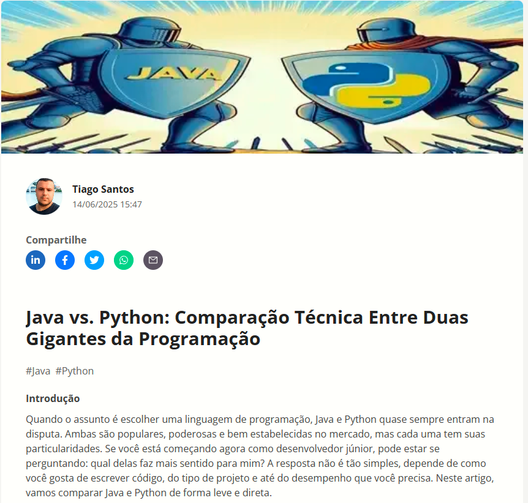

# Projeto artigo técnico gerado por Inteligencia Artificial (IA)

O artigo foi publicado na plataforma da DIO (Digital Innovation One ). 
Ele tem o objeto de informa e mostrar a principais diferenças entre as linguagens de programação Java e Python.

Abaixo é mostrada uma imagem do artigo publicado no site da DIO. 



📖 [Clique aqui para ler o artigo](https://dio.me/articles/java-vs-python-comparacao-tecnica-entre-duas-gigantes-da-programacao-95a84f70e478?utm_source=link&utm_campaign=mgm-java-vs-python-comparacao-tecnica-entre-duas-gigantes-da-programacao-95a84f70e478&utm_medium=article )


# Tecnologias utilizadas no projeto
- ChatGPT
- Copilot
- PowerPoint


# Prompts utilizados no chatGPt
```
Eu estou desenvolvendo um artigo tech sobre Java versus Python. Me dê 6 sugestões de headines para o meu artigo.
```

 ```
Aja como se fosse um escritor de artigos tech, escreva o artigo atendendo as regras abaixo:
{REGRAS}
No máximo 5 linhas por blocos de explicação
Me explique como se eu fosse um desenvolvedor junior.
Os blocos que serão criados estão abaixo:
Bloco 1. Escreva sobre as principais diferenças entre as linguagens de programação Java e Python, destacando paradigmas de programação e performance de cada uma das linguagens. 
Bloco 2. Cite 4 exemplos dos principais comandos que executam as mesmas funções em ambos.
Bloco 3. Dê exemplos de cases de uso que destacam a diferença entre as duas linguagens.
Faça um call to action para minhas redes sociais
Coloque três hastags que façam sentido
```

```
Me dê exemplos de tratamentos de exceção executados nas duas linguagens.
```

```
Prepare uma introdução para este artigo baseado no que foi feito anteriormente.
```

# Prompts utilizados no Copilot

```
Eu estou desenvolvendo um artigo tech sobre Java versus Python. Faça uma imagem para este artigo que represente uma batalha entre essas duas linguagens de programação.
```
```
A imagem precisa ser mais didática, substitua o dragão da imagem anterior por outro lutador com o escudo possuindo o símbolo da linguagem Java.
```
```
Refaça a imagem gerada anteriormente com o símbolo Java no escudo do lutador da esquerda.
```
```
Refaça imagem utilizando as duas imagens geradas anteriormente e melhore.
```


 

  


